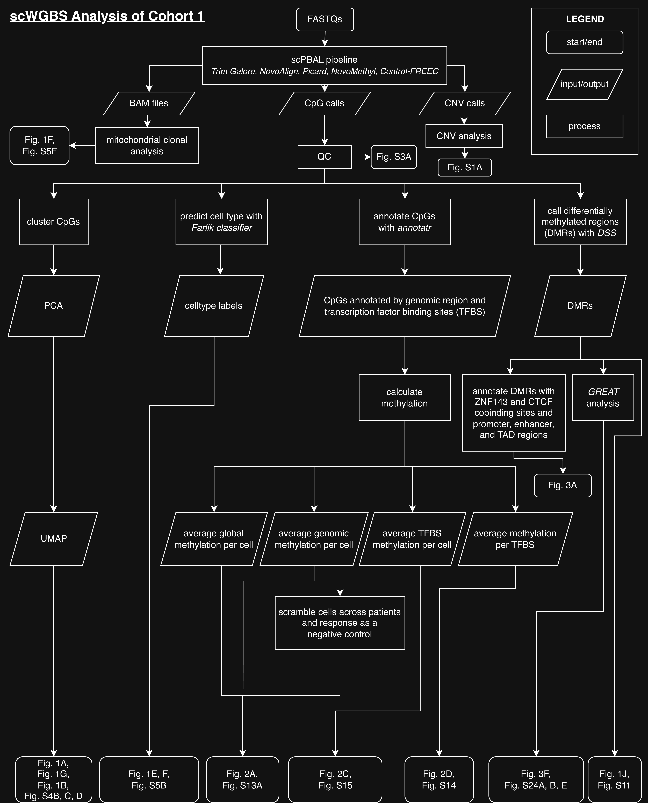
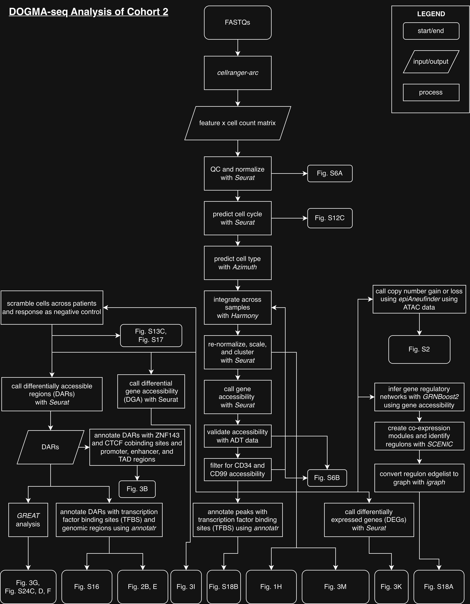
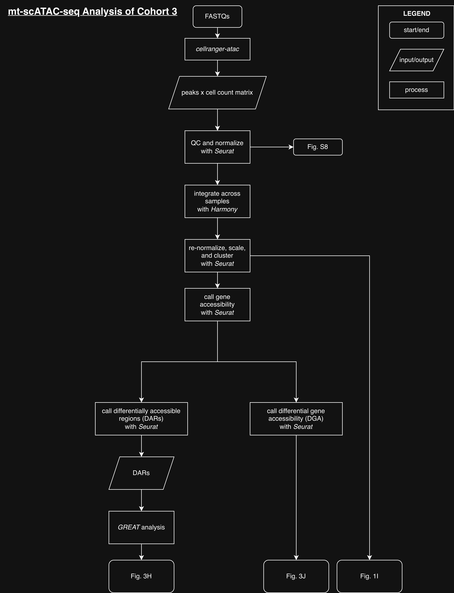
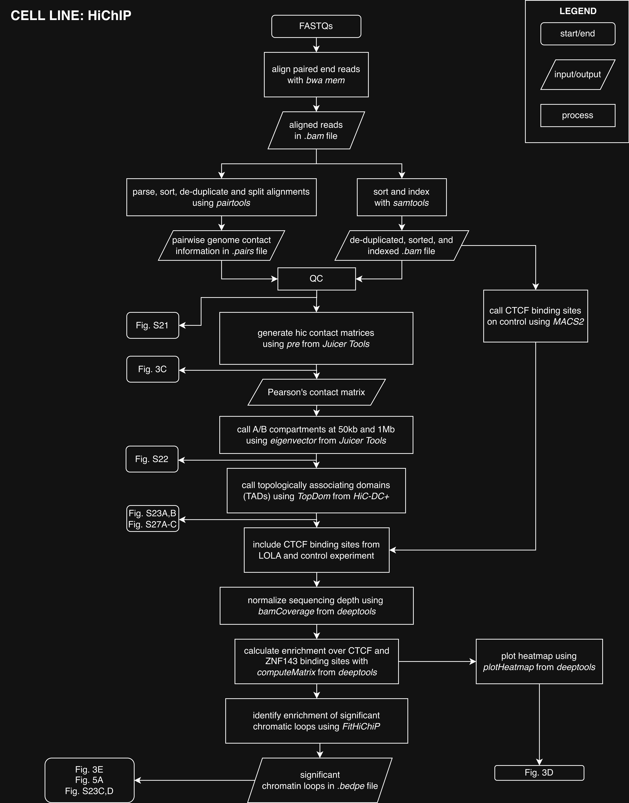
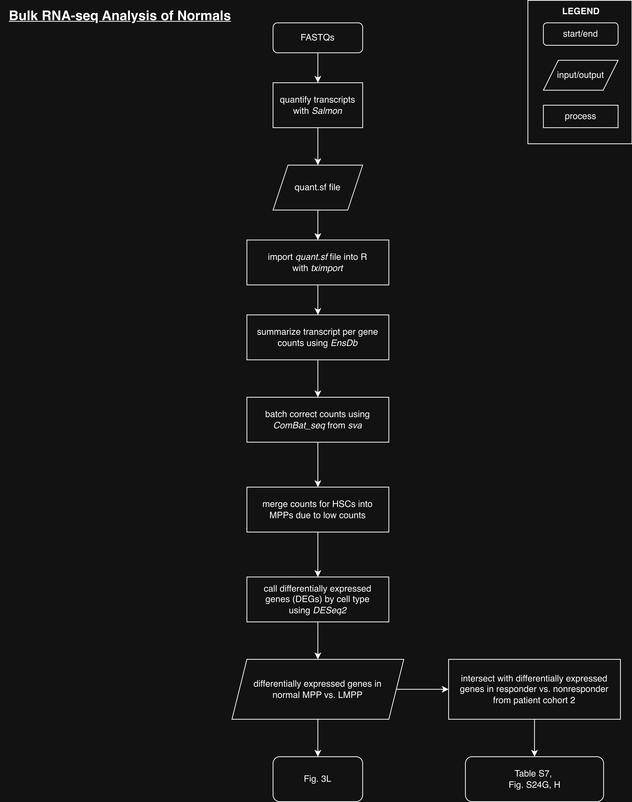

# Initial leukemic epigenomic state determines hypomethylating agent response

Gopal, A., Tam, D., Mey, F. _et al._ Initial leukemic epigenomic state determines hypomethylating agent response. _Nat Commun_ (2026). [https://doi.org/10.1038/s41467-026-73334-3](https://doi.org/10.1038/s41467-026-73334-3)

## Single-cell Whole Genome Bisulfite Sequencing Analysis of Cohort 1

## Single-cell Multiomic Analysis of Cohort 2

## Single-cell ATAC Analysis of Cohort 3

# HiChIP Analysis of OCI-AML3 Cell Line

# Analysis of Normal Samples

