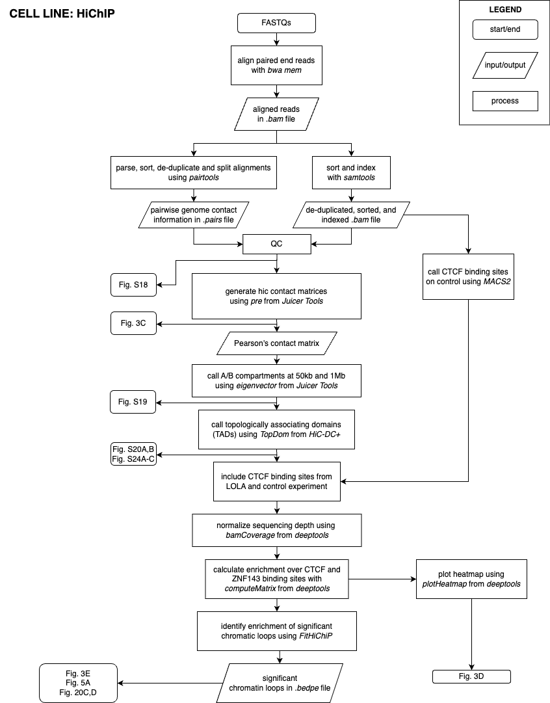

# The epigenomic state of leukemic stem cells determines hypomethylating agent response in myeloid malignancies

## Cohort 1: Single-cell Whole Genome Bisulfite Sequencing Analysis

## Cohort 2: Single-cell Multiomic Analysis

## Cohort 3: Single-cell ATAC Analysis

# Cell Line: HiChIP Analysis

# Normals Analysis

