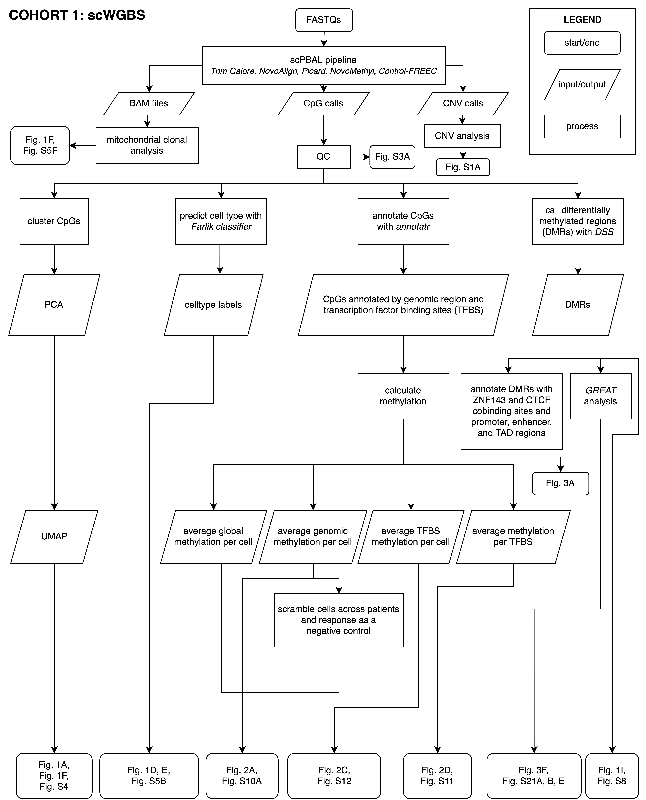

# Cohort 1: Single-cell Whole Genome Bisulfite Sequencing Analysis

## scPBAL Pipeline

Followed methods from Hui et. al, 2018.

Read trimmed using Trim Galore v0.4.0, aligned using NovoAlign v3.02.10, duplicates discarded using Picard v1.3.1 and methylation states called using NovoMethyl v1.01. CNVs called using Control-FREEC v11.6.

This pipeline produces a methylation state file with these columns:

`*.cons.Cmethyl.CpG.txt`:

| `chr` | `pos` (1-based) | `percent_meth` | `num_methylated` | `num_total` |
|-------|-----------------|----------------|------------------|-------------|
|       |                 |                |                  |             |

The aligner also produces the QC summary that contains:

`reads_align`, `cpg_count`, `t7_conversion`, `lambda_conversion`, `dup_rate`

## Cluster CpGs

Figures:

-   Fig. 1A: Single cell dimension reduction based on global methylation
-   Fig. 1D: Global methylation projection with predicted cell types
-   Fig. 1F: Patient 449 methylation
-   Fig. 2C: Co-projection of patient and normal reference cells

### `cluster_cpgs_by_global_methylation.R`

Perform dimension reduction of single cell methylation data, and create labels for biphenotypic patient cells based on associated response.

### `cluster_cpgs_by_tfbs_methylation.R`

Perform dimension reduction of single cells based on summarised methylation in transcription factor binding sites in the LOLA database.

## Mitochondrial clonal analysis

Figures:

-   Fig. 1F: Patient 449 clonal analysis annotations
-   Fig. S5F: Patient 449 clonotype mutations

### `clonal_structure_analysis.R`

Infers clonotypes of single-cell methylation data based on mutations in the mitochondrial DNA.

## Predict celltype with Farlik classifier

Figures:

-   Fig. 1E: Methylation cell type barplot

### `convert_farlik_to_novomethyl.R`

Converts the Farlik data into the same format as the output from Novomethyl above, and lifts over to hg19. Downloaded from: <https://www.ncbi.nlm.nih.gov/geo/query/acc.cgi?acc=GSE87197>

### `farlik_classifier_sample_annotation.R`

Adds our patient samples to the Farlik provided sample annotation data.

### `convert_farlik_region_ann.R`

Convert Farlik data to a bed file.

### `get_patient_farlik_regional_methylation.R`

Calculates the average methylation in our samples for each of the regions in the Farlik training data. Run on a cluster using `src/get_patient_farlik_regional_methylation.sh`.

### `get_farlik_farlik_regional_methylation.R`

Calculates the average methylation in the Farlik samples for each of the regions in the Farlik training data. Necessary since we're lifting over from hg38 to hg19. Run on a cluster using `src/get_farlik_farlik_regional_methylation.sh`.

### `merge_farlik_regional_methylation.R`

Because the previous step runs per cell, and we need the Farlik data in the same matrix, this script combines them all.

### `run_farlik_classifier.sh`

Using the Farlik script to predict the celltypes. Downloaded from <http://www.medical-epigenomics.org/papers/BLUEPRINT_methylomes/#prediction>

## Call differentially methylated regions (DMRs) with *DSS*

Figures:

-   Fig. 1I: DMR volcano plot

### `call_cohort1_dmrs.R`

DMRs are called using the package DSS. Two plates are pooled together for patient 371.

### `call_farlik_dmrs.R`

DMRs are called using the package DSS. MLP0s are recoded as LMPPs.

## Annotate CpGs with *annotatr*

-   Fig. 2A: Methylation boxplot

#### `import_cpgs.R`

Imports the methylation states produced by Novomethyl into R, and exports the imported tibbles as an RDS object. Flags whether cells passed QC.

### Average global methylation per cell 

#### `get_global_methylation.R`

Calculates the global methylation per single cell.

### Average genomic methylation per cell 

#### `get_regional_methylation.R`

Calculates the average methylation per genomic region per single cell. This script is run per cell on a cluster.

#### `combine_global_and_regional_methylation.R`

Combines the global and regional methylation into one data frame for visualization. Calculates an ANOVA statistic for both the patient data and the scramble. Adds a cell response column for bimodal patient based on previous UMAP clustering.

### Average transcription factor binding site (TFBS) methylation per cell 

Figures:

-   Fig. 2C: TFBS methylation UMAP
-   Fig. 2D: TFBS methylation volcano plot
-   Fig. S12: TFBS heatmap

#### `get_lola_methylation.R`

Calculates the average methylation per transcription factor binding site in the LOLA database, and 8 custom experiments. This script is run on a cluster using `get_patient_lola_methylation.sh` for the patient data, and `get_farlik_lola_methylation.sh` for the normal data.

### Average methylation per TFBS

#### `find_dmtfbs.R`

Calculates the difference in methylation between responder and non-responders and calculates a significance statistic.

## Annotate DMRs with CTCF and ZNF143 cobinding sites and promoter, enhancer, and TAD regions

Figures:

-   Fig. 3A: TAD boundaries and promoter/enhancer regions within hypomethylated DMRs

### `tad_promoter_enhancer_cohort1_analysis.R`

DMRs were annotated with promoter/enhancer regions and TAD boundaries. hg19 enhancers were downloaded from <http://www.enhanceratlas.org/data/AllEPs/hs/CD34+_EP.txt>.

## *GREAT* analysis

Figures:

-   Fig. 3F: Hypomethylated DMR GREAT scatterplot
-   Fig. S21A: Hypomethylated GREAT barplot
-   Fig. S21B Hypermethylated GREAT barplot
-   Fig. S21E Hypermethylated GREAT scatterplot

### `prepare_cohort1_for_great.R`

DMRs were filtered for \>40% hypo- or hypermethylation as input to [GREAT Analysis](http://great.stanford.edu/public/html/). Default parameters used including basal extension.

## CNV analysis 

Figures:

-   Fig. S1A: CNVs

### `cnv_analysis.R`

Filters data for those in G0 for CNVs called by Control-FREEC.

## Scramble cells across patients and response as a negative control

Figures:

-   Fig. S10A: Scramble

### `scramble_libraries.R`

Scrambles the cells across libraries as a control. Uses the helper scripts `make_library_scramble.R` and `calc_methylation_by_genomic_region.R`.
