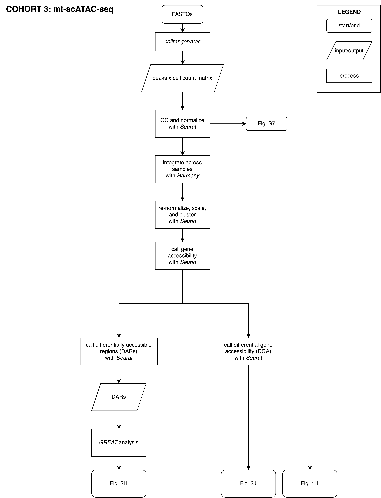

## Cohort 3: Single-cell ATAC Analysis

## Integrate across samples with _Harmony_

Figures:
- Fig. 1H: ATAC UMAP

### `analyze_cohort3.sh`

Single-cell ATAC analysis conducted in the same manner as Cohort 2 without RNA. No cell types were predicted for ATAC data. No cell cycle phases were predicted for ATAC data. This script is run individually for each sample in Cohort 3.

### `integrate_cohort3_samples.R`

Cohort 3 samples were integrated using Harmony.

## Call differentially accessible regions with _Seurat_

### `call_cohort3_dars.R`

Call DARs using `FindMarkers` in Seurat.

## _GREAT_ analysis

Figures:
- Fig. 3H: DAR GREAT scatterplot

### `prepare_cohort3_for_great.R`

DARs were filtered for adjusted p-value \< 0.001 and avg_log2FC \> 0.5 (hyeraccessible) as there was no threshold set during the calling process.

## Call differential gene accessibility with _Seurat_

Figures:

- Fig. 3J: DGA volcano plot

### `call_cohort3_dgas.R`

Differential gene accessibility called using Seurat's `FindMarkers` function. 
