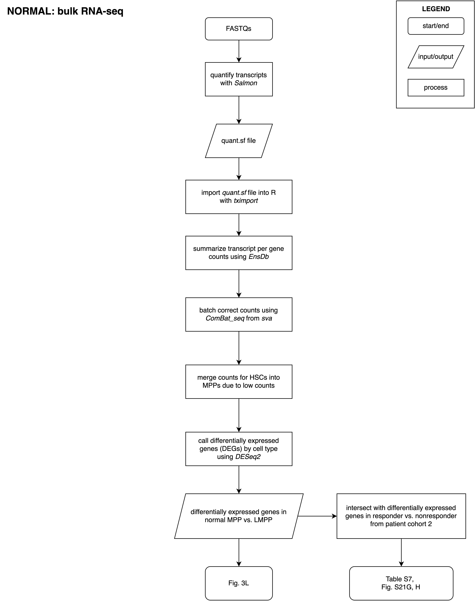

# Normal Analysis: Normal MPP vs LMPP

## Call differentially expressed genes (DEGs) by cell type using _DESeq2_

Figures: 
- Fig. 3L: DEG volcano plot

### `run_salmon.sh`

Run Salmon prior to DESeq2.

### `run_DESeq2.R`

Run DESeq2. 

## Intersect with differentially expressed genes in responder vs. nonresponder from patient cohort 2

Figures:
- Fig. S21G: Intersecting genes
- Fig. S21H: Intersecting TF genes

### `intersect_with_cohort2.R`

Intersect upregulated genes from MPP vs. LMPP with responder vs nonresponder from patient cohort 2. 

